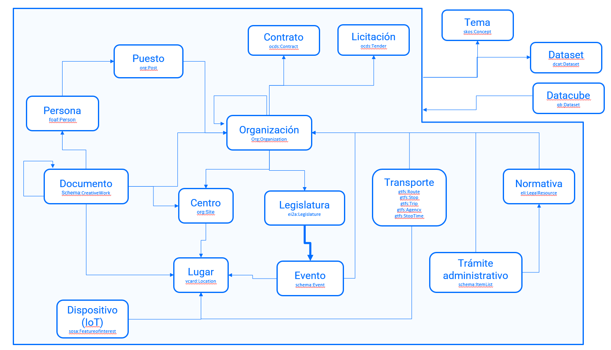

# EI2A. Estructura de Información Interoperable de Aragón

1. [Introducción](#introducción)

2. [Vocabularios](#vocabularios)

3. [Diagrama de alto nivel](#diagrama-de-alto-nivel)

4. [Diagrama UML](#diagrama-uml)

5. [Mantenimiento del modelo ontológico](#mantenimiento-del-modelo-ontológico)

6. Descripción de entidades principales

   6.1. Persona

## Introducción

Este repositorio contiene la propuesta de modelo ontológico EI2A, correspondiente al entregable (versión 1), relacionado con el hito de facturación: _[Nº1] 2.2.1 a) Actualización y mejoras de la web de ontologías del Gobierno de Aragón,_ ubicado en el proyecto _Lote 2 (Evolución de la infraestructura semántica de la Aragón Open Data)_.

El modelo desarrollado responde, en primer lugar, a un requisito de simplificación del modelo [EI2A en su versión 1.2.0](https://opendata.aragon.es/def/ei2a/), vigente en el momento de realización de este trabajo, con el objetivo de facilitar su comprensión por parte de los usuarios proveedores de datos y de los usuarios reutilizadores.

Por tanto, no se trata de modificar o actualizar la versión actual, sino de diseñar un nuevo modelo ontológico por completo, que mantenga los aspectos positivos del modelo actual y supere sus constatados problemas de uso y reutilización; y que ponga las bases para una evolución razonable que preserve el requisito primario de simplicidad.

Además de la sencillez, el modelo busca una flexibilidad que permita futuras extensiones. Esto se ha conseguido mediante el uso de categorizaciones con conceptos en lugar de jerarquías de clases (particularmente en Temas) y gracias a la reutilización de vocabularios estándar y generalistas para representar las entidades, evitando modelados propios y reduciendo al mínimo los atributos generados _ad-hoc_ para representar informaciones muy específicas de las entidades.

Los principios que han guiado el diseño del nuevo modelo ontológico han sido:

 - **Reusabilidad**. Evitar modelar conceptos y entidades con soluciones particulares cuando existen ontologías apropiadas y en uso.
 - **Extensibilidad**. El modelo debe permitir la incorporación de nuevas entidades y relaciones, si los datos a cargar lo precisan.   
 - **Mantenibilidad**. El nuevo modelo es más sencillo que el anterior, lo que facilitará su mantenimiento.
 - **Integridad**. En el nuevo modelo se especifican las restricciones de una manera más clara (some, only, min, max, exactly), para que los procesos de carga y reutilización puedan gestionar mejor que datos son necesarios en el modelo
 - **Usabilidad**. El uso de las propiedades no seguirá un diseño tipo “_open world_”, sino que se indican explícitamente cuáles son los atributos de cada entidad, para que los reutilizadores sepan con claridad los datos representados en cada caso.

## Vocabularios

En el nuevo modelo se ha descartado la reutilización de algunos vocabularios y ontologías que, a pesar de ser más específicos, ofrecen dudas en cuanto a su mantenimiento o vigencia; y otros que, siendo vigentes y apropiados, resultarían en una mayor complejidad del modelo EI2A sin aportar ventajas en el uso o reutilización.

En el siguiente listado se sumarizan las ontologías y vocabularios reutilizados en la definición del nuevo modelo ontológico del EI2A:

-   **_OWL:_** Lenguaje de la web semántica para definir una ontología y representar conocimiento acerca de cosas, grupos de cosas y sus relaciones. Véase [http://www.w3.org/2002/07/owl](http://www.w3.org/2002/07/owl).
-   **_RDF Schema:_** Vocabulario de uso general que se utiliza en el modelado de esquemas en RDF para la creación de otros Vocabularios. Véase [http://www.w3.org/2000/01/rdf-schema](http://www.w3.org/2000/01/rdf-schema).
-   **_XML Schema:_** Lenguaje de esquema utilizado para describir la estructura y las restricciones de los contenidos de los documentos XML de una forma muy precisa, más allá de las normas sintácticas impuestas por el propio lenguaje XML. Para facilitar la interoperabilidad de algunos metadatos se utilizan algunos de los tipos primitivos utilizados por el Esquema de definición de XML. Véase [http://www.w3.org/2001/XMLSchema](http://www.w3.org/2001/XMLSchema).
-   **_Simple Knowledge Organization System (SKOS):_** Ontología para definir sistemas de organización del conocimiento (vocabularios, tesauros, etc.). Véase [http://www.w3.org/2004/02/skos](http://www.w3.org/2004/02/skos).
-   **_Dublin Core Metadata Terms:_** Conjunto completo de términos elaborado por la iniciativa de metadatos de Dublin Core, entidad de referencia en el desarrollo de metadatos de amplio ámbito de actuación, así como en las buenas prácticas para su gestión. Los términos de Dublin Core incluyen clases, propiedades, vocabularios, esquemas comunes de codificación y tipos. Véase [http://dublincore.org/](http://dublincore.org/).
-   **_The Organization Ontology (ORG):_** Ontología desarrollada por W3C para describir organizaciones. Véase [https://www.w3.org/TR/vocab-org/](https://www.w3.org/TR/vocab-org/).
-   **_Friend Of A Friend:_** Ontología que describe personas, sus actividades y sus relaciones con otras personas y objetos. Véase [http://xmlns.com/foaf/0.1/](http://xmlns.com/foaf/0.1/).
-   **_BIO._** A vocabulary for biographical information. Sólo se usa el atributo biography para expresar la biografía en texto de los cargos del Gobierno de Aragón. [https://vocab.org/bio/](https://vocab.org/bio/)
-   **_Schema.org:_** Esquema ampliamente reconocido y utilizado por una amplia variedad de sitios Web (Google, Bing, Yahoo, …), que contiene diversas entidades de múltiples ámbitos para etiquetar el contenido de la Web. En el modelo de EI2A se usa para modelar documentos, expedientes, trámites y eventos. Véase [http://schema.org](http://schema.org/).
-   **_vCard._** vCard Ontology. Es una ontología que mapea la especificación vCard, que se usa para describir personas y organizaciones, en particular su dirección con datos de geoposicionamiento. [https://www.w3.org/TR/vcard-rdf/](https://www.w3.org/TR/vcard-rdf/)
-   **_GTFS (General Transport Feed Specification):_** Vocabulario utilizado para modelar aspectos de transporte. Se mantiene este vocabulario, a pesar de [no estar actualizado desde el año 2016](https://github.com/OpenTransport/linked-gtfs) y de que también podría modelarse con schema.org; porque permitiría generar y publicar archivos GTFS de manera más directa y sencilla. Véase en [https://github.com/OpenTransport/linked-gtfs/blob/master/spec.md](https://github.com/OpenTransport/linked-gtfs/blob/master/spec.md) y [http://vocab.gtfs.org/gtfs.ttl](http://vocab.gtfs.org/gtfs.ttl)
-   **_ELI:_** European Legislation Identifier (ELI) legislación en un formato normalizado, de manera que pueda localizarse, intercambiarse y reutilizarse por encima de las fronteras Véase [http://data.europa.eu/eli/ontology](http://data.europa.eu/eli/ontology).
-   **_OCDS._** Open Contracting Data Standard (ontología generada en el proyecto They Buy for You). Modela los contratos públicos y el proceso de contratación. [http://data.tbfy.eu/ontology/ocds#](http://data.tbfy.eu/ontology/ocds)
-   **_SSN._** Semantic Sensor Network Ontology. Es una recomendación del W3C que permite el modelado de sistemas, sensores y dispositivos en el ámbito de IoT. Se aplica en EI2A para el modelado de sistemas de gestión de agua, sustituyendo a WISDOM, y permitirá la incorporación de otros sistemas y dispositivos en el futuro. Véase: [https://www.w3.org/TR/vocab-ssn/](https://www.w3.org/TR/vocab-ssn/)
-   **_Datacube._** The RDF Data Cube Vocabulary. Es una recomendación del W3C para publicar datos multidimensionales, como pueden ser los datos estadísticos, en un modo que permite su enlazado con datasets y conceptos. Ya se aplica en los datos incorporados en Aragopedia desde el IAEST (Instituto Aragonés de Estadística) y se utilizan en EI2A para modelar datos como el presupuesto de Aragón. [https://www.w3.org/TR/vocab-data-cube/](https://www.w3.org/TR/vocab-data-cube/)
-   **_wGS84_pos:_** Describe puntos a través de su latitud, longitud y altitud dentro de la especificación WGS84. Véase [http://www.w3.org/2003/01/geo](http://www.w3.org/2003/01/geo).
-   **_OWL-Time:_** Ontología utilizada para describir conceptos temporales desarrollada por el W3C. Incluye elementos como instantes, intervalos de tiempo, duraciones y momentos específicos. Véase [http://www.w3.org/2006/time](http://www.w3.org/2006/time).
-   **_PROV-O._** The PROV Ontology. Proponemos que el proceso de carga en el nuevo grafo genere información de la procedencia de cada entidad, modelando mediante esta recomendación del W3C. Cada entidad cargada o actualizada incorporará un triple informando del proceso de carga del que proviene. [https://www.w3.org/TR/prov-o/](https://www.w3.org/TR/prov-o/)
-   **_DCAT._** Data Catalog Vocabulary. Se trata de una recomendación del W3C para facilitar la interoperabilidad de entre catálogos de datos publicados en la web y permite la descripción de datasets y servicios de datos. En el ámbito del proyecto se usará, además, para mostrar información explicativa del dato y su procedencia. [https://www.w3.org/TR/vocab-dcat-2/](https://www.w3.org/TR/vocab-dcat-2/)

Durante el proceso de análisis se han descartado los siguientes vocabularios:

- **_WISDOM_** (Water analytics and Intelligent Sensing for Demand Optimised Management, ver [Project impact on standardization and liaison activities. Final report](https://cordis.europa.eu/docs/projects/cnect/5/619795/080/deliverables/001-WISDOMWP5D55FinalDelivered.pdf)). La ontología desarrollada, en el ámbito de un proyecto europeo, es muy completa y permite modelar los dispositivos y procesos relacionados con la gestión inteligente del agua (_smart water_). Su uso en el nuevo modelo presentaba dos inconvenientes. En primer lugar, resulta demasiado complejo para el caso de uso de los datos de Aragón. En segundo, el modelo WISDOM no parece estar mantenido y finalmente no ha conseguido formar parte de un grupo de interés de W3C. Los datos de dispositivos de agua de Aragón quedan suficientemente modelados con SSN (ver más arriba) que, además, era una de las ontologías reutilizadas por WISDOM.
- **_OpenBudget_** (ver [https://github.com/openbudgets/data-model](https://github.com/openbudgets/data-model)) El proyecto no está mantenido y, a pesar de que la ontología es adecuada para modelar el presupuesto de una administración pública, resulta demasiado compleja para el uso esperado. Los presupuestos se modelarán con Datacube.
- **_HARMONET:_** Ontología generada para modelar aspectos de turismo. No se ha mantenido ni incorporado a ningún proceso de estandarización. De momento las entidades de turismo se modelarán como organizaciones y lugares usando los temas para categorizarlas en el ámbito del turismo.
- **_Categorization Ontology:_** Ontología generada para categorizar webs, subdominios o portales del Gobierno de Aragón. Está basada en la categorización de enlinea.aragon.es. Véase [CategorizationOntology.owl](https://opendata.aragon.es/def/ei2a/CategorizationOntology.owl). Se sustituye por una categorización SKOS.
- **_ISA Programme Person Core Vocabulary:_** Vocabulario que proporciona un conjunto de clases y propiedades para describir personas. Véase [https://www.w3.org/ns/person](https://www.w3.org/ns/person).

## Diagrama de alto nivel

En el siguiente diagrama presentamos el modelo de alto nivel y las relaciones de las entidades principales propuestas:

## Diagrama UML

## Mantenimiento del modelo ontológico

Para el mantenimiento del modelo ontológico proponemos usar el presente repositorio de GitHub (https://github.com/aragonopendata/EI2A-ontologia), del siguiente modo:

- Generación de un nuevo proyecto en GitHub para albergar la documentación y el archivo OWL generado.
- Configuración de GitHub pages para el acceso a la documentación.
- Uso de issues para gestionar los reportes de errores y las peticiones de cambio.
- Generación de una rama para trabajar sobre los cambios.
  - Rama de versión cuando sea un cambio mayor.
  - Rama relacionada con el issue cuando se trate de solucionar un error o un cambio menor.
- Generación de una release correspondiente a cambios mayores.

Además de la documentación de GitHub, generaremos una documentación HTML mediante WiDoCo, al estilo de la existente actualmente, en la que se describirán las entidades, atributos, propiedades y relaciones de todos los objetos.

