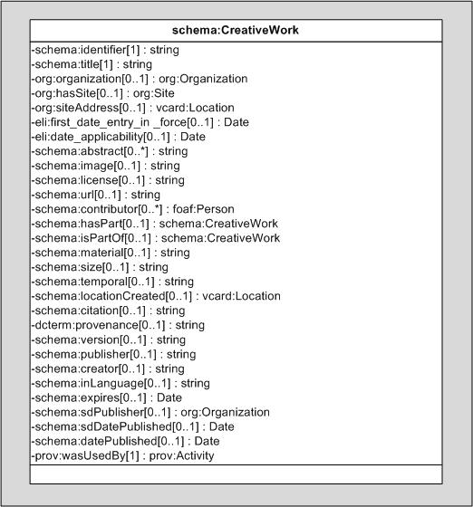

# EI2A. Estructura de Información Interoperable de Aragón

1. [Introducción](#1-introducción)

2. [Vocabularios](#2-vocabularios)

3. [Diagrama de alto nivel](#3-diagrama-de-alto-nivel)

4. [Diagrama UML](#4-diagrama-uml)

5. [Mantenimiento del modelo ontológico](#5-mantenimiento-del-modelo-ontológico)

6. [Descripción de entidades principales](#6-descripción-de-entidades-principales)

   6.1. [Persona](#61-persona)
 
   6.2. [Organización](#62-organización)
 
   6.3. [Lugar](#63-lugar)
 
   6.4. [Evento](#64-evento)
 
   6.5. [Legislatura](#65-legislatura)
 
   6.6. [Documento](#66-documento)
 
   6.7. [Normativa](#67-normativa)
 
   6.8. [Contrato](#68-contrato)
 
   6.9. [Licitación](#69-licitación)
 
   6.10. [Trámite administrativo](#610-trámite-administrativo)
 
   6.11. [Transporte](#611-transporte)
 
   6.12. [Tema](#612-tema)
 
   6.13. [DataCube](#613-datacube)
 
   6.14. [Sistemas y dispositivos de gestión de agua](#614-sistemas-y-dispositivos-de-gestión-de-agua)
 
   6.15. [Información de Datasets y Procedencia](#615-información-de-datasets-y-procedencia)
 
   [Anexo A. Organigrama del Gobierno de Aragón](#anexo-a-organigrama-del-gobierno-de-aragón)

## 1. Introducción

Este repositorio contiene la propuesta de modelo ontológico EI2A, correspondiente al entregable (versión 1), relacionado con el hito de facturación: _[Nº1] 2.2.1 a) Actualización y mejoras de la web de ontologías del Gobierno de Aragón,_ ubicado en el proyecto _Lote 2 (Evolución de la infraestructura semántica de la Aragón Open Data)_.

El modelo desarrollado responde, en primer lugar, a un requisito de simplificación del modelo [EI2A en su versión 1.2.0](https://opendata.aragon.es/def/ei2a/), vigente en el momento de realización de este trabajo, con el objetivo de facilitar su comprensión por parte de los usuarios proveedores de datos y de los usuarios reutilizadores.

Por tanto, no se trata de modificar o actualizar la versión actual, sino de diseñar un nuevo modelo ontológico por completo, que mantenga los aspectos positivos del modelo actual y supere sus constatados problemas de uso y reutilización; y que ponga las bases para una evolución razonable que preserve el requisito primario de simplicidad.

Además de la sencillez, el modelo busca una flexibilidad que permita futuras extensiones. Esto se ha conseguido mediante el uso de categorizaciones con conceptos en lugar de jerarquías de clases (particularmente en Temas) y gracias a la reutilización de vocabularios estándar y generalistas para representar las entidades, evitando modelados propios y reduciendo al mínimo los atributos generados _ad-hoc_ para representar informaciones muy específicas de las entidades.

Los principios que han guiado el diseño del nuevo modelo ontológico han sido:

 - **Reusabilidad**. Evitar modelar conceptos y entidades con soluciones particulares cuando existen ontologías apropiadas y en uso.
 - **Extensibilidad**. El modelo debe permitir la incorporación de nuevas entidades y relaciones, si los datos a cargar lo precisan.   
 - **Mantenibilidad**. El nuevo modelo es más sencillo que el anterior, lo que facilitará su mantenimiento.
 - **Integridad**. En el nuevo modelo se especifican las restricciones de una manera más clara (some, only, min, max, exactly), para que los procesos de carga y reutilización puedan gestionar mejor que datos son necesarios en el modelo
 - **Usabilidad**. El uso de las propiedades no seguirá un diseño tipo “_open world_”, sino que se indican explícitamente cuáles son los atributos de cada entidad, para que los reutilizadores sepan con claridad los datos representados en cada caso.

## 2. Vocabularios

En el nuevo modelo se ha descartado la reutilización de algunos vocabularios y ontologías que, a pesar de ser más específicos, ofrecen dudas en cuanto a su mantenimiento o vigencia; y otros que, siendo vigentes y apropiados, resultarían en una mayor complejidad del modelo EI2A sin aportar ventajas en el uso o reutilización.

En el siguiente listado se sumarizan las ontologías y vocabularios reutilizados en la definición del nuevo modelo ontológico del EI2A:

-   **_OWL:_** Lenguaje de la web semántica para definir una ontología y representar conocimiento acerca de cosas, grupos de cosas y sus relaciones. Véase [http://www.w3.org/2002/07/owl](http://www.w3.org/2002/07/owl).
-   **_RDF Schema:_** Vocabulario de uso general que se utiliza en el modelado de esquemas en RDF para la creación de otros Vocabularios. Véase [http://www.w3.org/2000/01/rdf-schema](http://www.w3.org/2000/01/rdf-schema).
-   **_XML Schema:_** Lenguaje de esquema utilizado para describir la estructura y las restricciones de los contenidos de los documentos XML de una forma muy precisa, más allá de las normas sintácticas impuestas por el propio lenguaje XML. Para facilitar la interoperabilidad de algunos metadatos se utilizan algunos de los tipos primitivos utilizados por el Esquema de definición de XML. Véase [http://www.w3.org/2001/XMLSchema](http://www.w3.org/2001/XMLSchema).
-   **_Simple Knowledge Organization System (SKOS):_** Ontología para definir sistemas de organización del conocimiento (vocabularios, tesauros, etc.). Véase [http://www.w3.org/2004/02/skos](http://www.w3.org/2004/02/skos).
-   **_Dublin Core Metadata Terms:_** Conjunto completo de términos elaborado por la iniciativa de metadatos de Dublin Core, entidad de referencia en el desarrollo de metadatos de amplio ámbito de actuación, así como en las buenas prácticas para su gestión. Los términos de Dublin Core incluyen clases, propiedades, vocabularios, esquemas comunes de codificación y tipos. Véase [http://dublincore.org/](http://dublincore.org/).
-   **_The Organization Ontology (ORG):_** Ontología desarrollada por W3C para describir organizaciones. Véase [https://www.w3.org/TR/vocab-org/](https://www.w3.org/TR/vocab-org/).
-   **_Friend Of A Friend:_** Ontología que describe personas, sus actividades y sus relaciones con otras personas y objetos. Véase [http://xmlns.com/foaf/0.1/](http://xmlns.com/foaf/0.1/).
-   **_BIO._** A vocabulary for biographical information. Sólo se usa el atributo biography para expresar la biografía en texto de los cargos del Gobierno de Aragón. [https://vocab.org/bio/](https://vocab.org/bio/)
-   **_Schema.org:_** Esquema ampliamente reconocido y utilizado por una amplia variedad de sitios Web (Google, Bing, Yahoo, …), que contiene diversas entidades de múltiples ámbitos para etiquetar el contenido de la Web. En el modelo de EI2A se usa para modelar documentos, expedientes, trámites y eventos. Véase [http://schema.org](http://schema.org/).
-   **_vCard._** vCard Ontology. Es una ontología que mapea la especificación vCard, que se usa para describir personas y organizaciones, en particular su dirección con datos de geoposicionamiento. [https://www.w3.org/TR/vcard-rdf/](https://www.w3.org/TR/vcard-rdf/)
-   **_GTFS (General Transport Feed Specification):_** Vocabulario utilizado para modelar aspectos de transporte. Se mantiene este vocabulario, a pesar de [no estar actualizado desde el año 2016](https://github.com/OpenTransport/linked-gtfs) y de que también podría modelarse con schema.org; porque permitiría generar y publicar archivos GTFS de manera más directa y sencilla. Véase en [https://github.com/OpenTransport/linked-gtfs/blob/master/spec.md](https://github.com/OpenTransport/linked-gtfs/blob/master/spec.md) y [http://vocab.gtfs.org/gtfs.ttl](http://vocab.gtfs.org/gtfs.ttl)
-   **_ELI:_** European Legislation Identifier (ELI) legislación en un formato normalizado, de manera que pueda localizarse, intercambiarse y reutilizarse por encima de las fronteras Véase [http://data.europa.eu/eli/ontology](http://data.europa.eu/eli/ontology).
-   **_OCDS._** Open Contracting Data Standard (ontología generada en el proyecto They Buy for You). Modela los contratos públicos y el proceso de contratación. [http://data.tbfy.eu/ontology/ocds#](http://data.tbfy.eu/ontology/ocds)
-   **_SSN._** Semantic Sensor Network Ontology. Es una recomendación del W3C que permite el modelado de sistemas, sensores y dispositivos en el ámbito de IoT. Se aplica en EI2A para el modelado de sistemas de gestión de agua, sustituyendo a WISDOM, y permitirá la incorporación de otros sistemas y dispositivos en el futuro. Véase: [https://www.w3.org/TR/vocab-ssn/](https://www.w3.org/TR/vocab-ssn/)
-   **_Datacube._** The RDF Data Cube Vocabulary. Es una recomendación del W3C para publicar datos multidimensionales, como pueden ser los datos estadísticos, en un modo que permite su enlazado con datasets y conceptos. Ya se aplica en los datos incorporados en Aragopedia desde el IAEST (Instituto Aragonés de Estadística) y se utilizan en EI2A para modelar datos como el presupuesto de Aragón. [https://www.w3.org/TR/vocab-data-cube/](https://www.w3.org/TR/vocab-data-cube/)
-   **_wGS84_pos:_** Describe puntos a través de su latitud, longitud y altitud dentro de la especificación WGS84. Véase [http://www.w3.org/2003/01/geo](http://www.w3.org/2003/01/geo).
-   **_OWL-Time:_** Ontología utilizada para describir conceptos temporales desarrollada por el W3C. Incluye elementos como instantes, intervalos de tiempo, duraciones y momentos específicos. Véase [http://www.w3.org/2006/time](http://www.w3.org/2006/time).
-   **_PROV-O._** The PROV Ontology. Proponemos que el proceso de carga en el nuevo grafo genere información de la procedencia de cada entidad, modelando mediante esta recomendación del W3C. Cada entidad cargada o actualizada incorporará un triple informando del proceso de carga del que proviene. [https://www.w3.org/TR/prov-o/](https://www.w3.org/TR/prov-o/)
-   **_DCAT._** Data Catalog Vocabulary. Se trata de una recomendación del W3C para facilitar la interoperabilidad de entre catálogos de datos publicados en la web y permite la descripción de datasets y servicios de datos. En el ámbito del proyecto se usará, además, para mostrar información explicativa del dato y su procedencia. [https://www.w3.org/TR/vocab-dcat-2/](https://www.w3.org/TR/vocab-dcat-2/)

Durante el proceso de análisis se han descartado los siguientes vocabularios:

- **_WISDOM_** (Water analytics and Intelligent Sensing for Demand Optimised Management, ver [Project impact on standardization and liaison activities. Final report](https://cordis.europa.eu/docs/projects/cnect/5/619795/080/deliverables/001-WISDOMWP5D55FinalDelivered.pdf)). La ontología desarrollada, en el ámbito de un proyecto europeo, es muy completa y permite modelar los dispositivos y procesos relacionados con la gestión inteligente del agua (_smart water_). Su uso en el nuevo modelo presentaba dos inconvenientes. En primer lugar, resulta demasiado complejo para el caso de uso de los datos de Aragón. En segundo, el modelo WISDOM no parece estar mantenido y finalmente no ha conseguido formar parte de un grupo de interés de W3C. Los datos de dispositivos de agua de Aragón quedan suficientemente modelados con SSN (ver más arriba) que, además, era una de las ontologías reutilizadas por WISDOM.
- **_OpenBudget_** (ver [https://github.com/openbudgets/data-model](https://github.com/openbudgets/data-model)) El proyecto no está mantenido y, a pesar de que la ontología es adecuada para modelar el presupuesto de una administración pública, resulta demasiado compleja para el uso esperado. Los presupuestos se modelarán con Datacube.
- **_HARMONET:_** Ontología generada para modelar aspectos de turismo. No se ha mantenido ni incorporado a ningún proceso de estandarización. De momento las entidades de turismo se modelarán como organizaciones y lugares usando los temas para categorizarlas en el ámbito del turismo.
- **_Categorization Ontology:_** Ontología generada para categorizar webs, subdominios o portales del Gobierno de Aragón. Está basada en la categorización de enlinea.aragon.es. Véase [CategorizationOntology.owl](https://opendata.aragon.es/def/ei2a/CategorizationOntology.owl). Se sustituye por una categorización SKOS.
- **_ISA Programme Person Core Vocabulary:_** Vocabulario que proporciona un conjunto de clases y propiedades para describir personas. Véase [https://www.w3.org/ns/person](https://www.w3.org/ns/person).

## 3. Diagrama de alto nivel

En el siguiente diagrama presentamos el modelo de alto nivel y las relaciones de las entidades principales propuestas:

## 4. Diagrama UML

## 5. Mantenimiento del modelo ontológico

Para el mantenimiento del modelo ontológico proponemos usar el presente repositorio de GitHub (https://github.com/aragonopendata/EI2A-ontologia), del siguiente modo:

- Generación de un nuevo proyecto en GitHub para albergar la documentación y el archivo OWL generado.
- Configuración de GitHub pages para el acceso a la documentación.
- Uso de issues para gestionar los reportes de errores y las peticiones de cambio.
- Generación de una rama para trabajar sobre los cambios.
  - Rama de versión cuando sea un cambio mayor.
  - Rama relacionada con el issue cuando se trate de solucionar un error o un cambio menor.
- Generación de una release correspondiente a cambios mayores.

Además de la documentación de GitHub, generaremos una documentación HTML mediante WiDoCo, al estilo de la existente actualmente, en la que se describirán las entidades, atributos, propiedades y relaciones de todos los objetos.

## 6. Descripción de las entidades principales

### 6.1. Persona

#### 6.1.1 Descripción de vocabulario y entidad seleccionada

Para modelar a las personas utilizamos dos vocabularios:

- **_FOAF_**. Datos públicos de filiación y relación con su puesto en una organización, si lo tiene.
- **_ORG_**. Puesto ocupado por la persona en una organización. El puesto puede contar con fechas de vigencia y está relacionado con un rol.
- **_BIO_**. Biografía en formato texto de la persona.

#### 6.1.2. Diagrama de la entidad

#### 6.1.3. Definición avanzada de los atributos

Persona
|Entidad|Atributo|Descriptor|Tipo|Multiplicidad|
|:----|:----|:----|:----|:----|
|Person|dc:identifier|Identificador de la persona|String|0..1|
| |foaf:name|Nombre completo|String|1|
| |foaf:givenName|Nombre |String|1|
| |foaf:familyName|Apellidos |String|1|
| |foaf:phone|Teléfono|String|0..1|
| |bio:biography|Biografía|String|0..1|
| |foaf:mbox|Email|String|0..1|
| |foaf:homepage|Página web|String|0..1|
| |foaf:img|Foto|String|0..1|
| |org:holds|Enlace con el puesto|org:Post|0..* |
|org:Post|dc:identifier|Identificador el puesto|String|1|
| |ei2a:order|Orden|Int|1|
| |org:role|Enlace con Rol|org:Role|1|
| |time:hasBeginning|Fecha de inicio|Date|0..1|
| |time:hasEnd|Fecha de Final|Date|0..1|
| |org:postIn|Enlace con Organización|org:Organization|1|
| |org:heldBy|Inversa de org:holds|org:Person|1|

Rol
|Entidad|Atributo|Descriptor|Tipo|Multiplicidad|
|:----|:----|:----|:----|:----|
|Rol|dc:identifier|Identificador del rol|String|1|
| |dc:title|Nombre del rol|String|1|

#### 6.1.4. Casos de uso

Las vistas más destacadas relacionadas con las personas son las siguientes:
|Id de vista|Descripción|Datos|Conjunto de datos |Nº de accesos|Última act.|
|:----|:----|:----|:----|:----|:----|
|160|Cargos|[GA_OD_CORE](https://opendata.aragon.es/GA_OD_Core/preview?view_id=160&_pageSize=100&_page=1)|[BANCO_DATOS](https://opendata.aragon.es/datos/catalogo/dataset/organigrama-del-gobierno-de-aragon)|555|19/03/2020|
|3|Pleno municipio|[GA_OD_CORE](https://opendata.aragon.es/GA_OD_Core/preview?view_id=3&_pageSize=100&_page=1)|[BANCO_DATOS](https://opendata.aragon.es/datos/catalogo/dataset/composicion-de-plenos-municipales)|190|19/03/2020|
|69|Registro de Guías de Turismo|[GA_OD_CORE](https://opendata.aragon.es/GA_OD_Core/preview?view_id=69&_pageSize=100&_page=1)|[BANCO_DATOS](https://opendata.aragon.es/datos/catalogo/dataset/guias-turisticos-en-la-comunidad-autonoma-de-aragon)|180|19/03/2020|
|4|Pleno Comarca|[GA_OD_CORE](https://opendata.aragon.es/GA_OD_Core/preview?view_id=4&_pageSize=100&_page=1)|[BANCO_DATOS](https://opendata.aragon.es/datos/catalogo/dataset/composicion-de-plenos-comarcales)|90|19/03/2020|
|51|Composicion del Pleno de Consorcios|[GA_OD_CORE](https://opendata.aragon.es/GA_OD_Core/preview?view_id=51&_pageSize=100&_page=1)| | | |
|52|Composicion del Pleno de Entidades Menores|[GA_OD_CORE](https://opendata.aragon.es/GA_OD_Core/preview?view_id=52&_pageSize=100&_page=1)| | | |
|53|Composicion del Pleno de Mancomunidades|[GA_OD_CORE](https://opendata.aragon.es/GA_OD_Core/preview?view_id=53&_pageSize=100&_page=1)| | | |
|54|Composicion del Pleno de Organismos Autónomos|[GA_OD_CORE](https://opendata.aragon.es/GA_OD_Core/preview?view_id=54&_pageSize=100&_page=1)| | | |
|56|Composicion del Pleno de Villas y Tierras|[GA_OD_CORE](https://opendata.aragon.es/GA_OD_Core/preview?view_id=56&_pageSize=100&_page=1)| | | |

En la representación de una persona destaca la vista _160 – Cargos_ donde, además de ser los datos más visitados, podemos ver un ejemplo de vinculación con otras entidades como son las Organizaciones a las que pertenecen y el Cargo que ejercen en ellas.

El mapeo correspondiente a esta vista con el nuevo modelo es el siguiente (los atributos de origen que no aparecen en la siguiente tabla no se utilizan en el mapeo con el nuevo modelo):
|Atributo de origen|Entidad principal|Propiedad |Entidad relacionada|Propiedad|
|:----|:----|:----|:----|:----|
|NOMBRE|foaf:Person|foaf:name| | |
|TELEFONO|foaf:Person|foaf:phone| | |
|BIOGRAFIA|foaf:Person|bio:biography| | |
|FOTO_PATH|foaf:Person|foaf:img| | |
|EMAIL|foaf:Person|foaf:mbox| | |
|PAGINA_WEB|foaf:Person|foaf:homepage| | |
|ID_CARGO|foaf:Person -> org:Post|dc:identifier| | |
|ID_ENTIDAD|foaf:Person -> org:Post|org:postIn|org:Organization|dc:identifier|
|ORDEN|foaf:Person -> org:Post|ei2a:order| | |
|CARGO|foaf:Person -> org:Post|org:role|org:Role|dc:title|
|FECHA_INI|foaf:Person -> org:Post|time:hasBeginning| | |
|FECHA_FIN|foaf:Person -> org:Post|time:hasEnd| | |
| | | |

### 6.2. Organización	

#### 6.2.1. Descripción de vocabulario y entidad seleccionada
Para modelar a las organizaciones y sus centros utilizamos dos vocabularios:

- ***ORG***. Modela datos públicos de filiación de la organización y la relación con otras organizaciones (suborganización; antecesora y sucesora mediante ChangeEvent) e incluye relaciones inversas hacia centros, contratos y puestos. La clasificación SKOS permitirá diferenciar varios tipos de organizaciones, desde las unidades administrativas del gobierno a los hoteles rurales.
- ***vCARD***. Modela lugares con direcciones y geoposicionamiento, para definir dónde se encuentra un centro.

#### 6.2.2. Diagrama de la entidad

                 

#### 6.2.3. Definición avanzada de los atributos

Organización	

|Entidad|Atributo|Descriptor|Tipo|Multiplicidad|
|:----|:----|:----|:----|:----|
|org:Organization|dc:identifier|Identificador|String|0..1|
| |org:identifier|Identificador de la organización|String|1|
| |dc:title|Nombre |String|1|
| |org:subOrganizationOf|Enlace con Organización padre|org:Organization|0..1|
| |ei2a:legislature|Enlace con legislatura|ei2a:Legislature|1|
| |dc:description|Observaciones|String |0..1|
| |ei2a:order|Orden|int|0..1|
| |org:hasSite|Enlace con Centro|org:Site|0..* |
| |foaf:homepage|Página web|String|0..1|
| |ocds:isSupplierFor|Enlace con el contrato|ocds:Contract|0..* |
| |ocds:isTendererFor|Enlace con la licitación|ocds:Tender|0..* |
| |org:hasPost|Inversa de org:postIn|org:Post|0..* |
| |org:classification|Enlace categoría|Skos:Concept|1|
| |org:resultedFrom|Enlace a evento  creación de organización|Org:ChangeEvent|0..1|
| |org:changedBy|Enlace con evento  modificación de organización|Org:ChangeEvent|0..1|
|org:ChangeEvent|org:originalOrganization|Organización que ha sido creada tras un evento, inversa org:resultedFrom|org:Organization|0..1|
| |org:resultingOrganization|Organización que ha sido modificada tras un evento, inversa org:changedBy|org:Organization|0..1|
| |prov:startedAtTime|Fecha de inicio del cambio|date|1|
| |prov:endedAtTime|Fecha de Fin del cambio|date|0..1|
| | | |
| | | |

Centro y Lugar	

|Entidad|Atributo|Descriptor|Tipo|Multiplicidad|
|:----|:----|:----|:----|:----|
|org:Site|dc:identifier|Identificador|String|1|
| |dc:title|Nombre|string|0..1|
| |org:siteAddress|Enlace con lugar|vcard:Location|0..1|
|vcard:Location|vcard:fn|Nombre|string|0..1|
| |vcard:region|Provincia|string|1|
| |vcard:locality|Localidad |String|1|
| |vcard:postal-code|Código postal|int |1|
| |vcard:street-address|Dirección  |String |1|
| |vcard:email|Email|string|0..1|
| |vcard:tel|Teléfono|int |0..1|
| |vcard:org|Enlace con organización|org:Organization|1|
| |vcard:hasGeo|Enlace con geo|geo|0..* |
| |wgs84_pos:lat|Latitud|Double|0..1|
| |wgs84_pos:long|Longitud|Double |0..1|
| |org:siteAddress|Enlace con lugar|org:Site|0..1|

#### 6.2.4. Casos de uso

Las vistas relacionadas con organización, ordenadas según el interés generado en el banco de datos son:

|Id de vista|Descripción|Datos|Conjunto de datos |Nº de accesos|Última act.|
|:----|:----|:----|:----|:----|:----|
|104|IAF polígonos industriales|GA_OD_CORE|BANCO_DATOS|1493|19/03/2020|
|24|Datos de Mancomunidades|GA_OD_CORE|BANCO_DATOS|616|19/03/2020|
|159|Entidades|GA_OD_CORE|BANCO_DATOS|556|19/03/2020|
|11|Datos Municipio|GA_OD_CORE|BANCO_DATOS|422|19/03/2020|
|67|Registro de Cafeterías y Restaurantes|GA_OD_CORE|BANCO_DATOS|414|19/03/2020|
|65|Registro de Alojamientos hoteleros|GA_OD_CORE|BANCO_DATOS|374|19/03/2020|
|88|SGT Agricultura, Comarcas agrarias|GA_OD_CORE|BANCO_DATOS|366|09/09/2015|
|64|Registro de Albergues y Refugios|GA_OD_CORE|BANCO_DATOS|324|19/03/2020|
|286|IGEAR - Centros de Salud|GA_OD_CORE|BANCO_DATOS|316|14/04/2020|
|287|IGEAR - Hospitales|GA_OD_CORE|BANCO_DATOS|316|14/04/2020|
|288|IGEAR - Centros de Salud Mental|GA_OD_CORE|BANCO_DATOS|316|14/04/2020|
|73|Registro de Alojamientos de Turismo Rural|GA_OD_CORE|BANCO_DATOS|301|19/03/2020|
|63|Registro de Agencias de Viaje|GA_OD_CORE|BANCO_DATOS|268|19/03/2020|
|10|Datos Comarca|GA_OD_CORE|BANCO_DATOS|252|19/03/2020|
|16|Datos de diputación|GA_OD_CORE|BANCO_DATOS|244|19/03/2020|
|26|Datos de Núcleos|GA_OD_CORE|BANCO_DATOS|215|19/03/2020|
|89|SGT Agricultura, Oficinas comarcales|GA_OD_CORE|BANCO_DATOS|209|10/09/2015|
|241|INAGA Terrenos cinegéticos y no cinegéticos de Aragón|GA_OD_CORE|BANCO_DATOS|205|01/10/2018|
|66|Registro de Apartamentos turísticos|GA_OD_CORE|BANCO_DATOS|191|19/03/2020|
|68|Registro de Campings Turísticos|GA_OD_CORE|BANCO_DATOS|179|19/03/2020|
|70|Registro de Oficinas de Turismo|GA_OD_CORE|BANCO_DATOS|178|19/03/2020|
|167|IGEAR - Centros Educativos|GA_OD_CORE|BANCO_DATOS|178|25/11/2020|
|282|Bibliotecas - Definición de las bibliotecas|GA_OD_CORE|BANCO_DATOS|171|20/02/2020|
|72|Registro de Empresas de Turismo Activo|GA_OD_CORE|BANCO_DATOS|148|19/03/2020|
|17|Direcciones de interés|GA_OD_CORE|BANCO_DATOS|143|19/03/2020|
|20|Datos de Entidades Singulares|GA_OD_CORE|BANCO_DATOS|135|19/03/2020|
|12|Agrupación Secretarial|GA_OD_CORE|BANCO_DATOS|132|19/03/2020|
|22|Datos de Fundaciones|GA_OD_CORE|BANCO_DATOS|129|19/03/2020|
|71|Registro de Puntos de Información Turística|GA_OD_CORE|BANCO_DATOS|129|19/03/2020|
|13|Consorcios|GA_OD_CORE|BANCO_DATOS|114|19/03/2020|
|28|Datos de Organizaciones Complementarias|GA_OD_CORE|BANCO_DATOS|102|19/03/2020|
|246|Responsable del tratamiento|GA_OD_CORE|BANCO_DATOS|92|28/01/2020|
|247|Encargado del tratamiento|GA_OD_CORE|BANCO_DATOS|92|28/01/2020|
|248|Delegado de protección de datos|GA_OD_CORE|BANCO_DATOS|92|28/01/2020|
|278|Información al ciudadano de protección de datos - |GA_OD_CORE|BANCO_DATOS|92|28/01/2020|
|27|Datos de Organismo Autónomo|GA_OD_CORE|BANCO_DATOS|85|19/03/2020|
|19|Datos de Entidad Menor|GA_OD_CORE|BANCO_DATOS|84|19/03/2020|
|164|IGEAR - Oficinas del Consumidor|GA_OD_CORE|BANCO_DATOS|33|14/05/2018|
|34|Datos de Sociedad Mercantil|GA_OD_CORE| | | |
|35|Datos de Villas y Tierras|GA_OD_CORE| | | |
|57|Relaciones de Comarca|GA_OD_CORE| | | |
|58|Relaciones de Entidades Singulares|GA_OD_CORE| | | |
|59|Relaciones de Fundaciones|GA_OD_CORE| | | |
|60|Relaciones de Mancomunidades|GA_OD_CORE| | | |
|61|Relaciones de Villas y Tierras|GA_OD_CORE| | | |
|143|CRA - Centros|GA_OD_CORE| | | |
|283|Bibliotecas - Definición de las sucursales|GA_OD_CORE| | | |
		

Para la representación de las organizaciones destaca la vista 159 – Entidades donde encontramos la relación con las entidades de Centro y a su vez, con Lugar. También es posible encontrar la relación jerárquica entre las unidades organizativas y sus organizaciones padre. Por último, cada organización se encuentra ubicada en el tiempo gracias a la relación con la entidad Legislatura.

El mapeo correspondiente a esta vista con el nuevo modelo es el siguiente (los atributos de origen que no aparecen en la siguiente tabla no se utilizan en el mapeo con el nuevo modelo):

|Atributo de origen|Entidad principal|Propiedad |Entidad relacionada|Propiedad|
|:----|:----|:----|:----|:----|
|ID_ENTIDAD|org:Organization|dc:identifier| | |
|ID_ENTIDAD_PADRE|org:Organization|org:subOrganizationOf|org:Organization|dc:identifier|
|ID_LEGISLATURA|org:Organization|ei2a:legislature|ei2a:Legislature|dc:identifier|
|ORDEN|org:Organization|ei2a:order| | |
|NOMBRE|org:Organization|dc:title| | |
|OBSERVACIONES|org:Organization|dc:description| | |
|COD_SIU|org:Organization|org:identifier| | |
|PAGINA_WEB|org:Organization|foaf:homepage| | |
|EDIFICIO|org:Organization -> org:Site|dc:title| | |
|DIRECCION|org:Organization -> org:Site|vcard_siteAddress|vcard:Location|vcard:street-address|
|CP|org:Organization -> org:Site|vcard_siteAddress|vcard:Location|vcard:postal-code|
|LOCALIDAD|org:Organization -> org:Site|vcard_siteAddress|vcard:Location|vcard:locality|
|PROVINCIA|org:Organization -> org:Site|vcard_siteAddress|vcard:Location|vcard:region|
|TELEFONO|org:Organization -> org:Site|vcard_siteAddress|vcard:Location|vcard:tel|
|EMAIL|org:Organization -> org:Site|vcard_siteAddress|vcard:Location|vcard:email|
|COOR_X|org:Organization -> org:Site|vcard_siteAddress|vcard:Location|wgs84_pos:lat|
|COOR_Y|org:Organization -> org:Site|vcard_siteAddress|vcard:Location|wgs84_pos:long|

### 6.3. Lugar

#### 6.3.1. Descripción de vocabulario y entidad seleccionada

Para modelar los lugares utilizamos un vocabulario:

- ***vCARD***. Modela lugares con direcciones y geoposicionamiento.
- ***wGS84_pos***. Describe puntos a través de su latitud y longitud, dentro de la especificación WGS84.

#### 6.3.2. Diagrama de la entidad
 
 

#### 6.3.3. Definición avanzada de los atributos

Lugar

|Entidad|Atributo|Descriptor|Tipo|Multiplicidad|
|:----|:----|:----|:----|:----|
|vcard:Location|vcard:fn|nombre|string|0..1|
| |vcard:region|Provincia|string|1|
| |vcard:locality|Localidad |String|1|
| |vcard:postal-code|Código postal|int |1|
| |vcard:street-address|Dirección  |String |1|
| |vcard:email|Email|string|0..1|
| |vcard:tel|Teléfono|int |0..1|
| |vcard:org|Enlace con organización|org:Organization|1|
| |vcard:hasGeo|Enlace con Centro|geo|0..* |
| |wgs84_pos:lat|Latitud|Double|0..1|
| |wgs84_pos:long|Longitud|Double |0..1|
| |org:siteAddress|Enlace con lugar|org:Site|0..1|

#### 6.3.4. Casos de uso

Las vistas que podemos relacionar con Lugar son las siguientes:

|Id de vista|Descripción|Datos|Conjunto de datos |Nº de accesos|Última act.|
|:----|:----|:----|:----|:----|:----|
|102|Turismo de Aragón, Senderos Rutas|GA_OD_CORE|BANCO_DATOS|669|19/03/2020|
|157|IAA Depuradoras núcleos de población servidos|GA_OD_CORE|BANCO_DATOS|255|19/03/2020|
|261|Provincias|GA_OD_CORE|BANCO_DATOS|93|28/01/2020|
|262|Códigos de país|GA_OD_CORE|BANCO_DATOS|93|28/01/2020|
|142|CRA - Localidades|GA_OD_CORE| | | |

Se puede obtener una representación en la vista 159 – Entidades donde aunque su entidad principal es Organización, es posible visualizar la vinculación con Lugar. El mapeo se puede revisar en el apartado 6.2.4 de este documento.

### 6.4. Evento

#### 6.4.1. Descripción de vocabulario y entidad seleccionada

Para modelar los lugares utilizamos el vocabulario Schema:

- ***Schema.org***. Utilizamos la clase Event con sus atributos relevantes al caso.

#### 6.4.2. Diagrama de la entidad 

 
 
#### 6.4.3. Definición avanzada de los atributos

Evento

|Entidad|Atributo|Descriptor|Tipo|Multiplicidad|
|:----|:----|:----|:----|:----|
|schema:Event|schema:identifier|Identificador del evento|string|0..1|
| |schema:name|Nombre del evento|string|1|
| |schema:description|Descripción |string|1|
| |schema:startDate|Fecha de inicio|Date |1|
| |schema:endDate|Fecha de fin|Date|0..1|
| |schema:eventSchedule|Horario del evento  |string|0..1|
| |schema:image|Imagen|string|0..1|
| |schema:location|Enlace con lugar del evento|vcard:Location|0..1|

#### 6.4.4. Casos de uso

Las vistas más destacadas relacionadas con los eventos son las siguientes:

|Id de vista|Descripción|Datos|Conjunto de datos |Nº de accesos|Última act.|
|:----|:----|:----|:----|:----|:----|
|62|Registro de llamadas|GA_OD_CORE|BANCO_DATOS|335|14/05/2018|
|90|DG Relaciones Institucionales, Procesos Electorales|GA_OD_CORE|BANCO_DATOS|112|11/11/2020|
|15|Datos de cursos|GA_OD_CORE| | | |
|32|Datos de Postgrado|GA_OD_CORE| | | |

En la vista 62 – Registro de llamadas podemos ver un ejemplo de vinculación de Evento con otras entidades como Lugar.
El mapeo correspondiente a esta vista con el nuevo modelo es el siguiente (los atributos de origen que no aparecen en la siguiente tabla no se utilizan en el mapeo con el nuevo modelo):

|Atributo de origen|Entidad principal|Propiedad |Entidad relacionada|Propiedad|
|:----|:----|:----|:----|:----|
|NUMERO_REG|schema:Event|schema:identifier| | |
|FECHA_REG|schema:Event|schema:startDate| | |
|PROVINCIA|schema:Event|schema:location|vcard:location|vcard:region|
|LOCALIDAD|schema:Event|schema:location|vcard:location|vcard:locality|
| | |

### 6.5. Legislatura

#### 6.5.1. Descripción de vocabulario y entidad seleccionada
Hemos decidido modelar legislatura a pesar de que sólo se va a cargar la actual, porque pensamos que en un futuro podrían añadirse más. La hemos modelado como una subclase de schema:Event:

- ***Schema.org***. El modelado de evento se ajusta a lo que define a una legislatura.

#### 6.5.2. Diagrama de la entidad

   

#### 6.5.3. Definición avanzada de los atributos

Legislatura

|Entidad|Atributo|Descriptor|Tipo|Multiplicidad|
|:----|:----|:----|:----|:----|
|ei2a:Legislature|schema:identifier|Identificador de la legislatura|String|1|
| |schema:name|Nombre de la legislatura|String|1|
| |schema:startDate|Fecha de inicio|Date|0..1|
| |schema:endDate|Fecha final|Date|0..1|

#### 6.5.4. Casos de uso

La vista relacionada con la legislatura es la siguiente:

|Id de vista|Descripción|Datos|Conjunto de datos |Nº de accesos|Última act.|
|:----|:----|:----|:----|:----|:----|
|158|Periodo de legislatura|GA_OD_CORE|BANCO_DATOS|556|19/03/2020|

El mapeo correspondiente a esta vista con el nuevo modelo es el siguiente (los atributos de origen que no aparecen en la siguiente tabla no se utilizan en el mapeo con el nuevo modelo):

|Atributo de origen|Entidad principal|Propiedad |Entidad relacionada|Propiedad|
|:----|:----|:----|:----|:----|
|ID_LEGISLATURA|ei2a:Legislature|schema:identifier| | |
|NOMBRE|ei2a:Legislature|schema:name| | |
|FECHA_INI|ei2a:Legislature|schema:startDate| | |
|FECHA_FIN|ei2a:Legislature|schema:endDate| | |

### 6.6. Documento

#### 6.6.1. Descripción de vocabulario y entidad seleccionada

Para modelar los lugares utilizamos el vocabulario:

- ***Schema.org***. Hemos optado por modelar con schema:CreativeWork, explicitando atributos opcionales que se usarán en función del tipo de documento que se quiera representar en el grafo; como expedientes, obras de arte, símbolos municipales o páginas web. Se complementa con algunos términos de ELI y Dublin Core e incluye relaciones con Organización, Centro y Lugar.

#### 6.6.2. Diagrama de la entidad

 
 
#### 6.6.3. Definición avanzada de los atributos

Documento

|Entidad|Atributo|Descriptor|Tipo|Multiplicidad|
|:----|:----|:----|:----|:----|
|schema:CreativeWork|schema:identifier|Identificador|String|1|
| |schema:title|Título|String|1|
| |org:organization|Enlace con organización|org:Organization|0..1|
| |org:hasSite|Enlace con centro|org:Site|0..1|
| |org:siteAddress|Enlace con lugar|vcard:Location|0..1|
| |eli:first_date_entry_in_force|Fecha de entrada en vigor|Date|0..1|
| |eli:date_applicability|Fecha de aplicación|Date|0..1|
| |eli:date_publication|Fecha de publicación|Date|0..1|
| |schema:abstract|Descripción|String|0..* |
| |schema:image|Imagen |String|0..1|
| |schema:license|Licencia |String|0..1|
| |schema:url|url |String|0..1|
| |schema:contributor|Enlace con persona |Foaf:Person|0..* |
| |schema:hasPart|Enlace con documento|schema:CreativeWork|0..1|
| |schema:isPartOf|Inversa de schema:hasPart|schema:CreativeWork|0..1|
| |schema:material|Material|String|0..1|
| |schema:size|Tamaño |String|0..1|
| |schema:temporal|Literal de fecha (año)|String|0..1|
| |schema:locationCreated|Enlace con lugar de creación|vcard:Location|0..1|
| |schema:citation|Bibliografía|String|0..1|
| |dcterm:provenance|Decreto|String|0..1|
| |schema:version|Edición|String|0..1|
| |schema:publisher|Editorial |String|0..1|
| |schema:creator|Creador|String|0..1|
| |schema:inLanguage|Idioma|String|0..1|
| |schema:expires|Fecha de suspensión|Date|0..1|

#### 6.6.4. Casos de uso

Las vistas más destacadas relacionadas con los documentos son las siguientes:

|Id de vista|Descripción|Datos|Conjunto de datos |Nº de accesos|Última act.|
|:----|:----|:----|:----|:----|:----|
|77|Planeamiento General|GA_OD_CORE|BANCO_DATOS|304|25/11/2020|
|75|Modificaciones de Planeamiento General|GA_OD_CORE|BANCO_DATOS|255|06/11/2020|
|76|Planeamiento de Desarrollo|GA_OD_CORE|BANCO_DATOS|147|19/03/2020|
|74|Modificaciones de Planeamiento de Desarrollo|GA_OD_CORE|BANCO_DATOS|132|19/03/2020|
|237|ENERGIA - Cert. Data|GA_OD_CORE|BANCO_DATOS|129|06/06/2018|
|260|Meta datos estado|GA_OD_CORE|BANCO_DATOS|94|28/01/2020|
|103|DG Cultura y Patrimonio, Colecciones de Museos de Aragon|GA_OD_CORE|BANCO_DATOS|93|25/11/2020|
|265|Dominios|GA_OD_CORE|BANCO_DATOS|72|30/10/2019|
|280|Bibliotecas - Títulos existentes|GA_OD_CORE| | | |
|281|Bibliotecas - Ejemplares|GA_OD_CORE| | | |
|25|Datos de Noticias|GA_OD_CORE| | | |
|30|Datos de Planeamiento|GA_OD_CORE| | | |
|31|Datos de Plantillas|GA_OD_CORE| | | |
|145|DARA|GA_OD_CORE| | | |
|2|Símbolos|GA_OD_CORE| | | |

Si revisamos en detalle la vista 77 – Planeamiento General , podemos ver un ejemplo de vinculación con otra entidad como la Organización. El mapeo correspondiente a esta vista con el nuevo modelo es el siguiente (los atributos de origen que no aparecen en la siguiente tabla no se utilizan en el mapeo con el nuevo modelo):

|Atributo de origen|Entidad principal|Propiedad |Entidad relacionada|Propiedad|
|:----|:----|:----|:----|:----|
|NUM_EXPTE|schema:CreativeWork|schema:identifier| | |
|TITULO|schema:CreativeWork|schema:title| | |
|MUNICIPIO_EXPEDIENTE|org:Organization|dc:identifier| | |
|PROVINCIA_EXPEDIENTE|org:Organization|dc:identifier| | |
|NOMBRE_MUNICIPIO|org:Organization|dc:title| | |
|F_ACUERDO|eli:LegalResource|eli:date_applicability| | |
|FECHA_ENTRADA|eli:LegalResource|eli:first_date_entry_in_force| | |
|F_PUB_ACUERDO|eli:LegalResource|eli:date_publication| | |
|TELEFONO|schema:CreativeWork|foaf:phone| | |
|TELEFONO|schema:CreativeWork|foaf:phone| | |
|TELEFONO|schema:CreativeWork|foaf:phone| | |
		

### 6.7. Normativa

#### 6.7.1. Descripción de vocabulario y entidad seleccionada

Para modelar las normas utilizamos el vocabulario:

- ***ELI***. Modela normas y leyes, como las ordenanzas generales y fiscales. En este caso se opta por un vocabulario específico que incluye atributos más ajustados.

#### 6.7.2. Diagrama de la entidad

 
 
#### 6.7.3. Definición avanzada de los atributos

Normativa

|Entidad|Atributo|Descriptor|Tipo|Multiplicidad|
|:----|:----|:----|:----|:----|
|eli:LegalResource|eli:number|Identificador de la normativa|String|0..1|
| |eli:description|Texto|String|1|
| |eli:id_local|Tipo|String|1|
| |eli:date_applicability|Fecha de aplicación|Date|0..1|
| |eli:first_date_entry_in_force|Fecha de acuerdo |Date|1|
| |eli:date_publication|Fecha de aplicación|Date|1|
| |eli:passed_by|Enlace con agente|eli:Agent|1|
| |eli:amends|Enlace con normativa a la cual modifica|eli:LegalResource|0..1|
| |eli:amended_by|Enlace inversa con normativa que modifica|eli:LegalResource|0..1|
| |eli:type_document|Enlace con tipo documento|eli:ResourceType|1|
|eli:ResourceType|skos:inScheme|Tipo de documento|string|1|
|eli:Agent|org:organization|Enlace con organización|org:Organizacion|1|

#### 6.7.4. Casos de uso

Las vistas más destacadas relacionadas con la normativa son las siguientes:

|Id de vista|Descripción|Datos|Conjunto de datos |Nº de accesos|Última act.|
|:----|:----|:----|:----|:----|:----|
|7|Ordenanzas Fiscales Municipio|GA_OD_CORE|BANCO_DATOS|221|19/03/2020|
|5|Ordenanzas Generales Municipio|GA_OD_CORE|BANCO_DATOS|202|19/03/2020|
|6|Ordenanzas Generales Comarca|GA_OD_CORE|BANCO_DATOS|98|19/03/2020|
|8|Ordenanzas Fiscales Comarca|GA_OD_CORE|BANCO_DATOS|76|19/03/2020|
|38|Ordenanzas fiscales de Consorcios|GA_OD_CORE| | | |
|39|Ordenanzas fiscales de Diputación|GA_OD_CORE| | | |
|40|Ordenanzas fiscales de Entidad Menor|GA_OD_CORE| | | |
|41|Ordenanzas fiscales de Mancomunidades|GA_OD_CORE| | | |
|42|Ordenanzas fiscales de Organismos Autónomos|GA_OD_CORE| | | |
|43|Ordenanzas fiscales de Villas y Tierras|GA_OD_CORE| | | |
|44|Ordenanzas generales de Consorcios|GA_OD_CORE| | | |
|45|Ordenanzas generales de Diputaciones|GA_OD_CORE| | | |
|46|Ordenanzas generales de Entidades Menores|GA_OD_CORE| | | |
|47|Ordenanzas generales de Mancomunidades|GA_OD_CORE| | | |
|48|Ordenanzas generales de Núcleos|GA_OD_CORE| | | |
|49|Ordenanzas generales de Organismos Autónomos|GA_OD_CORE| | | |
|50|Ordenanzas generales de Villas y Tierras|GA_OD_CORE| | | |

El mapeo correspondiente a la vista 45 - Ordenanzas generales de Diputaciones se relaciona con la entidad Normativa y además con la entidad Organización de la siguiente forma (los atributos de origen que no aparecen en la siguiente tabla no se utilizan en el mapeo con el nuevo modelo):

|Atributo de origen|Entidad principal|Propiedad |Entidad relacionada|Propiedad|
|:----|:----|:----|:----|:----|
|DIPUTACION_ID|eli:Agent|org:organization|org:Organization|dc:identifier|
|DENOMINACION|eli:Agent|org:organization|org:Organization|dc:title|
|TIPO|eli:LegalResource|eli:type_document| | |
|TEXTO|eli:LegalResource|eli:description| | |
|ORDYREG_ID|eli:LegalResource|eli:id_local| | |
|CLOB_ID|eli:LegalResource|eli:number| | |
|F_ACUERDO_APRO_INI|eli:LegalResource|eli:date_applicability| | |
|F_ACUERDO_APRO_DEF|eli:LegalResource|eli:first_date_entry_in_force| | |
|F_PUBLICACION_APRO_DEF|eli:LegalResource|eli:date_publication| | |

### 6.8. Contrato

#### 6.8.1. Descripción de vocabulario y entidad seleccionada

Para modelar los contratos y sus procesos utilizamos el vocabulario:

- ***OCDS***. Modela contratos y el proceso de contratación. En este caso se opta por un vocabulario específico que incluye atributos más ajustados.

#### 6.8.2. Diagrama de la entidad

 
  

#### 6.8.3. Definición avanzada de los atributos

Contrato

|Entidad|Atributo|Descriptor|Tipo|Multiplicidad|
|:----|:----|:----|:----|:----|
|ocds:Contract|ocds:id|Identificador|Int|1|
| |ocds:description|Descripción|string|1|
| |org:organization|Enlace con Organización|org:Organization|1|
| |dc:title|Título|string|1|
| |ocds:hasContractPeriod|Enlace con Periodo|ocds:Period|0..* |
|ocds:Period|ocds:startDate|Fecha de inicio|Date|1|
| |ocds:endDate|Fecha de final|Date|0..1|

#### 6.8.4. Casos de uso

Las vistas más destacadas relacionadas con los contratos son las siguientes:

|Id de vista|Descripción|Datos|Conjunto de datos |Nº de accesos|Última act.|
|:----|:----|:----|:----|:----|:----|
|147|Transporte - Concesiones|GA_OD_CORE|BANCO_DATOS|718|19/03/2020|
|152|IAA - Contratos|GA_OD_CORE|BANCO_DATOS|253|19/03/2020|
|153|IAA - Contratos gastos anuales|GA_OD_CORE|BANCO_DATOS|253|19/03/2020|
|154|IAA - Contratos depuradoras incluidas|GA_OD_CORE|BANCO_DATOS|253|19/03/2020|

El mapeo correspondiente a la vista 152 – IAA - Contratos con el nuevo modelo es el siguiente (los atributos de origen que no aparecen en la siguiente tabla no se utilizan en el mapeo con el nuevo modelo):

|Atributo de origen|Entidad principal|Propiedad |Entidad relacionada|Propiedad|
|:----|:----|:----|:----|:----|
|CONTRATO|ocds:Contract|ocds:id| | |
|TITULO|ocds:Contract|dc:title| | |
|FECHA_INICIO|ocds:Contract|ocds:hasContractPeriod|ocds:Period|ocds:startDate|
|FECHA_FIN|ocds:Contract|ocds:hasContractPeriod|ocds:Period|ocds:endDate|
|EMPRESA|ocds:Contract -> org:organization|dc:title| | |
|DIRECCION|ocds:Contract -> org:organization -> org:Site|vcard_siteAddress|vcard:Location|vcard:street-address|
|CODIGO_POSTAL|ocds:Contract -> org:organization -> org:Site|vcard_siteAddress|vcard:Location|vcard:postal-code|
|MUNICIPIO|ocds:Contract -> org:organization -> org:Site|vcard_siteAddress|vcard:Location|vcard:locality|
|PROVINCIA|ocds:Contract -> org:organization -> org:Site|vcard_siteAddress|vcard:Location|vcard:region|

### 6.9. Licitación

#### 6.9.1. Descripción de vocabulario y entidad seleccionada

Al igual que en Contratos, usamos el siguiente vocabulario:

- ***OCDS***. Modela licitaciones. En este caso se opta por un vocabulario específico que incluye atributos más ajustados.

#### 6.9.2. Diagrama de la entidad

 
  
#### 6.9.3. Definición avanzada de los atributos

Licitación

|Entidad|Atributo|Descriptor|Tipo|Multiplicidad|
|:----|:----|:----|:----|:----|
|ocds:Tender|ocds:id|Identificador|Int|1|
| |dc:title|Título|string|1|
| |ocds:description|Descripción|string|1|
| |org:organization|Enlace con Organización|org:Organization|1|
| |ocds:hasTenderPeriod|Enlace con Periodo|ocds:Period|0..* |
|ocds:Period|ocds:startDate|Fecha de inicio|Date|1|
| |ocds:endDate|Fecha de final|Date|0..1|

#### 6.9.4. Casos de uso

La vista relacionada con Licitación es la siguiente:

|Id de vista|Descripción|Datos|Conjunto de datos |Nº de accesos|Última act.|
|:----|:----|:----|:----|:----|:----|
|284|Contratación - Licitaciones publicadas|GA_OD_CORE|BANCO_DATOS|408|11/03/2021|

El mapeo correspondiente a esta vista con el nuevo modelo es el siguiente (los atributos de origen que no aparecen en la siguiente tabla no se utilizan en el mapeo con el nuevo modelo):

|Atributo de origen|Entidad principal|Propiedad |Entidad relacionada|Propiedad|
|:----|:----|:----|:----|:----|
|FECHAPUBLICACION|ocds:Tender|ocds:hasTenderPeriod|ocds:Period|ocds:startDate|
|ORGANISMCODEGG|ocds:Tender|org:organization|org:Organization|org:identifier|
|NOMBREGG|ocds:Tender|org:organization|org:Organization|dc:title|
|IDEXPEDIENTEPLACSP|ocds:Tender|ocds:id| | |
|ORGANISMCODEOC|ocds:Tender|org:organization|org:Organization|org:identifier|
|NOMBREOC|ocds:Tender|org:organization|org:Organization|dc:title|
|OBJETOCONTRATO|ocds:Tender|dc:title| | |

### 6.10. Trámite administrativo

#### 6.10.1. Descripción de vocabulario y entidad seleccionada

Para modelar los lugares utilizamos el vocabulario:

- ***Schema.org***. Hemos optado por modelar con schema:ItemList, que permite definir el trámite con sus relaciones y cuenta con un ListItem para modelar los pasos del trámite, tal y como está definido en la web de Aragón.

#### 6.10.2. Diagrama de la entidad

 
 
#### 6.10.3. Definición avanzada de los atributos

Trámite administrativo

|Entidad|Atributo|Descriptor|Tipo|Multiplicidad|
|:----|:----|:----|:----|:----|
|schema:ItemList|schema:identifier|Identificador |string|0..1|
| |schema:title|Título|string|1|
| |schema:abstract|Descripción |string|1|
| |schema:itemListElement|Enlace con el  paso del tramite|schema:ListItem|1..* |
| |skos:concept|Enlace con categoría|skos:Concept|0..1|
| |org:organization|Enlace con organización|org:Organization|0..* |
| |eli:related_to|Enlace con normativa|eli:LegalResouce|0..* |
|schema:ListItem|schema:identifier|Identificador |string|0..1|
| |schema:title|Título del paso |string|1|
| |schema:abstract|Descripción del paso|string|1|
| |schema:nextItem|Enlace con siguiente paso del tramite|schema:ListItem|0..1|
| |schema:previousItem|Enlace con el paso previo del tramite|schema:ListItem|0..1|
| |schema:position|Posición|int|1|

#### 6.10.4. Casos de uso

Actualmente no disponemos de información de ninguna vista relacionada con trámites administrativos por lo que tendremos que incorporar un origen de estos datos para poder alinearlo con el nuevo modelo. 

### 6.11. Transporte

#### 6.11.1. Descripción de vocabulario y entidad seleccionada

Para modelar el transporte utilizamos el vocabulario:

- ***GTFS***. Se trata de un vocabulario inspirado en la iniciativa General Transit Feed Specification (GTFS). Se modelan datos de paradas, estaciones, etc. 
- ***WGS84***. Coordenadas de la entidad o de cada punto de una ruta expresada como un gtfs:Shape.
- ***vCard***. Opcionalmente, org:siteAddress hacia vCard:Location
- ***ORG***. Opcionalmente, enlace hacia una organización (municipio), org:organization hacia org:Organization.

#### 6.11.2. Diagrama de la entidad

 
 
#### 6.11.3. Definición avanzada de los atributos

Ruta

|Entidad|Atributo|Descriptor|Tipo|Multiplicidad|
|:----|:----|:----|:----|:----|
|gtfs:Route|dc:identifier|Identificador de la ruta|String|0..1|
| |dc:title|Nombre de la ruta|String|0..1|
| |gtfs:originStop|Parada de origen|gtfs:Stop|1|
| |gtfs:destinationStop|Parada de destino|gtfs:Stop|1|
| |gtfs:routeType|Tipo de ruta|gtfs:Bus|1|
| |gtfs:agency|Enlace con la agencia|gtfs:Agency|0..1|

Parada

|Entidad|Atributo|Descriptor|Tipo|Multiplicidad|
|:----|:----|:----|:----|:----|
|gtfs:Stop|dc:title|Nombre de la parada|string|1|
| |dc:identifier|Identificador de la parada|String|1|
| |wgs84_pos:long|Longitud|double|1|
| |wgs84_pos:lat|Latitud|double|1|
| |org:siteAddress|Lugar|vcard:Location|1|

Itinerario

|Entidad|Atributo|Descriptor|Tipo|Multiplicidad|
|:----|:----|:----|:----|:----|
|gtfs:Trip|dc:identifier|Identificador del viaje|string|1|
| |dc:description|descripción|string|0..1|
| |gtfd:route|Enlace con la ruta|gtfs:Route|1|
| |dc:date|Fecha del viaje|date|0..1|

Horario de parada

|Entidad|Atributo|Descriptor|Tipo|Multiplicidad|
|:----|:----|:----|:----|:----|
|gtfs:StopTime|dc:identifier|Identifica un viaje|string|0..1|
| |gtfs:stopSequence|Identifica el destino del viaje|int|1|
| |gtfs:arrivalTime|Hora de llegada|date|0..1|
| |gtfs:trip|Enlace con el viaje|gtfs:Trip|1|
| |gtfs:stop|Enlace con la parada|gtfs:Stop|1|

Agencia de transporte

|Entidad|Atributo|Descriptor|Tipo|Multiplicidad|
|:----|:----|:----|:----|:----|
|gtfs:Agency|dc:identifier|Identificador de la Agencia|string|1|
| |dc:title|Nombre de la Agencia|string|1|
| |rdfs:subClassOf|label|org:Organization|1|
| |foaf:name|Nombre organizacion|string|1|
| |schema:startDate|Fecha de inicio|Date|1|
| |schema:endDate|Fecha de fin|Date |0..1|
| |org:organization|Enlace con organización|org:Organization|1|

#### 6.11.4. Casos de uso

Las vistas relacionadas con Transporte son las siguientes:

|Id de vista|Descripción|Datos|Conjunto de datos |Nº de accesos|Última act.|
|:----|:----|:----|:----|:----|:----|
|148|TRANSPORTE - Expediciones|GA_OD_CORE|BANCO_DATOS|718|19/03/2020|
|149|TRANSPORTE - Expedición Parada Horario|GA_OD_CORE|BANCO_DATOS|718|19/03/2020|
|150|TRANSPORTE - Paradas|GA_OD_CORE|BANCO_DATOS|718|19/03/2020|
|151|TRANSPORTE - Rutas|GA_OD_CORE|BANCO_DATOS|718|19/03/2020|
|140|CRA - Datos de itinerarios de las rutas|GA_OD_CORE| | | |
|141|CRA - Paradas|GA_OD_CORE| | | |
|144|CRA - Datos de las rutas|GA_OD_CORE| | | |

El mapeo correspondiente a las vistas 148, 149, 150 y 150 de TRANSPORTE con el nuevo modelo donde se identifican las expediciones, rutas y paradas con sus horarios es el siguiente (los atributos de origen que no aparecen en la siguiente tabla no se utilizan en el mapeo con el nuevo modelo):

|Id|Atributo de origen|Entidad principal|Propiedad |Entidad relacionada|Propiedad|
|:----|:----|:----|:----|:----|:----|
|148|COD_EXP|gtfs:Trip|dc:identifier| | |
|148|FRECUENCIA|gtfs:Trip|dc:description| | |
| | | | | | |
|149|COD_EXPEDICION|gtfs:StopTime|gtfs:trip|gtfs:Trip|dc:identifier|
|149|ORDEN_PARADA|gtfs:StopTime|gtfs:stopSequence| | |
|149|COD_PARADA|gtfs:StopTime|gtfs:stop|gtfs:Stop|dc:identifier|
|149|HORARIO|gtfs:StopTime|gtfs:arrivalTime| | |
| | | | | | |
|150|COD_PARADA|gtfs:Stop|dc:identifier| | |
|150|DENO_DIRECCIÓN|gtfs:Stop|dc:title| | |
|150|NUCLEO|gtfs:Stop|org:siteAdress|vcard:Location|vcard:locality|
|150|X|gtfs:Stop|wgs84_pos:lat | | |
|150|Y|gtfs:Stop|wgs84_pos:long| | |
| | | | | | |
|151|COD_CONCESION|ocds:Contract|ocds:id| | |
|151|COD_RUTA|gtfs:Route|dc:identifier| | |
|151|DENO_RUTA|gtfs:Route|dc:title| | |
|151|ORIGEN|gtfs:Route|gtfs:originStop|gtfs:Stop|dc:title|
|151|DESTINO|gtfs:Route|gtfs:destinationStop|gtfs:Stop|dc:title|
| | | |

### 6.12. Tema

#### 6.12.1. Descripción de vocabulario y entidad seleccionada

Los temas del Gobierno de Aragón pasan a modelarse con SKOS, en lugar de como una jerarquía de clases, para facilitar el mantenimiento y la reutilización, así como la alineación con las categorías de la NTI. El vocabulario será, por tanto, ***SKOS***.

#### 6.12.2. Diagrama de la entidad

 
  
#### 6.12.3. Definición avanzada de los atributos

Tema

|Entidad|Atributo|Descriptor|Tipo|Multiplicidad|
|:----|:----|:----|:----|:----|
|skos:Concept|skos:prefLabel|Etiqueta|String|1|
| |dc:identifier|Identificador|String|1|
| |skos:broader|Enlace al concept padre|skos:Concept|1..* |
| |skos:narrower|Elementos hijos|skos:Concept|1|
| |skos:related|Enlace con concept relacionado|skos:Concept|1|
| |dc:source|Origen|string|1|
| |skos:symbol|Nivel|string|1|
|skos:Collection|dc:source|Fuente|string|1|
| |skos:scopeNote|Nota de alcance|string|1|
| |skos:member|Relación con los miembros|skos:Concept|1..* |

#### 6.12.4. Gestión y sincronización de temas

Los temas se sincronizaránn con los indicados en la vista 161 de GA_OD_CORE. Cada concepto SKOS estará relacionado con uno de los temas principales de la recomendación NTI, mediante `skos:broadMatch`. Por ejemplo:

    ei2a:kos/subvencion-medio-ambiente skos:broadMatch <http://datos.gob.es/kos/sector-publico/sector/medio-ambiente>

Cada categoría SKOS se relacionará con la clase del modelo actual que es sustituida por el nuevo tesauro. Para ello se añadirá un triple `rdfs:isDefinedBy` en cada clase del modelo actual, apuntando hacia una categoría SKOS. Por ejemplo:

    <http://opendata.aragon.es/def/ei2a/categorization#EnvironmentSubsidy> rdfs:isDefinedBy ei2a:kos/subvencion-medio-ambiente

### 6.13. DataCube

#### 6.13.1. Descripción de vocabulario y entidad seleccionada

Para modelar datasets de observaciones y medidas utilizamos el vocabulario:
- ***Datacube***. Este modelo permite añadir datasets muy específicos que se caracterizan por tener datos que podrían considerarse medidas. Este modelo ya se usa en el grafo de Aragopedia y se usará en el grafo del nuevo modelo para recoger los datos del presupuesto de Aragón.

#### 6.13.2. Diagrama de la entidad

 
 
#### 6.13.3. Casos de uso

Los datos del presupuesto de Aragón se modelarían del siguiente modo. En primer lugar, definimos la estructura de datos, que sería (en pseudocódigo):

    ei2a:recurso/dsd/presupuesto2021 a qb:DataStructureDefinition
    	qb:component [qb:dimension ei2a:recurso/dimension/capitulo; qb:order 1];
    	qb:component [qb:dimension ei2a:recurso/dimension/capitulo; qb:order 1];
    	qb:component [qb:dimension ei2a:recurso/dimension/articulo; qb:order 2];
    	qb:component [qb:dimension ei2a:recurso/dimension/concepto; qb:order 3];
    	qb:component [qb:dimension ei2a:recurss/dimension/subconcepto; qb:order 4];
    	qb:component [qb:measure ei2a:recurso/measure/importe];
    ei2a:recurso/dimension/capitulo a qb:DimensionProperty
    	rdfs:Label “Capítulo”;
    	rdfs:range skos:concept;
    	qb:concept ei2a:kos/capitulo;
    ei2a:recurso/dimension/articulo a qb:DimensionProperty
    	rdfs:Label “Artículo”;
    	rdfs:range skos:concept;
    	qb:concept ei2a:kos/articulo;
    ei2a:recurso/dimension/concepto a qb:DimensionProperty
    	rdfs:Label “Concepto”;
    	rdfs:range skos:concept;
    	qb:concept ei2a:kos/concepto;
    ei2a:recurso/dimension/subconcepto a qb:DimensionProperty
    	rdfs:Label “Subconcepto”;
    	rdfs:range skos:concept;
    	qb:concept ei2a:kos/subconcepto;
    ei2a:recurso/measure/importe a qb:MeasureProperty
    	rdfs:Label “Importe”;
    	rdfs:Range xsd:decimal;
	
A continuación, se define el dataset de presupuesto, con los valores de importes correspondientes, por ejemplo, para el dato de gastos de personal y altos cargos, sería:

    ei2a:recurso/dataset/presupuesto2021 a qb:Dataset
    	dct:title "Presupuesto del Gobierno de Aragón 2021";
    	qb:structure ei2a:recurso/dsd/presupuesto2021;
    ei2a:recurso/observacion/100000 a qb:Observation
    	qb:Dataset ei2a:recurso/dataset/presupuesto2021;
    	ei2a:recurso/dimension/capitulo ei2a:kos/capitulo-1;
    	ei2a:recurso/dimension/articulo ei2a:kos/articulo-10;
    	ei2a:recurso/dimension/concepto ei2a:kos/concepto-100;
    	ei2a:recurso/dimension/subconcepto ei2a:kos/subconcepto-100000;
    	ei2a:recurso/medida/importe 2678824.40;
    ei2a:kos/capitulo-1 a skos:Concept
    	rdfs:Label “Gasto de personal”;
    	skos:Narrower ei2a:kos/articulo-10, ei2a:kos/articulo-11, ..., ei2a:kos/articulo-18;
    ei2a:kos/articulo-10 a skos:Concept
    	rdfs:Label “Altos cargos”;
    	skos:Narrower ei2a:kos/concepto-100, ei2a:kos/concepto-101;

### 6.14. Sistemas y dispositivos de gestión de agua

#### 6.14.1. Descripción de vocabulario y entidad seleccionada

Para modelar los sistemas y dispositivos de gestión de agua utilizamos el vocabulario SSN (Semantic Sensor Network):

- ***SSN***. (Semantic Sensor Network Ontology). Modela sistemas y dispositivos en el ámbito de IoT. Como ya se ha indicado en el apartado de vocabularios, se reducen las clases respecto al uso anterior de WISDOM, lo que simplifica el modelo.
- ***vCard***. Opcionalmente, org:siteAddress hacia vCard:Location
- ***ORG***. Opcionalmente, enlace hacia una organización (municipio), org:organization hacia org:Organization.

#### 6.14.2. Diagrama de la entidad

 
 
#### 6.14.3. Definición avanzada de los atributos

Dispositivo

|Entidad|Atributo|Descriptor|Tipo|Multiplicidad|
|:----|:----|:----|:----|:----|
|sosa:Featureofinterest|dc:identifier|Identificador|String|1|
| |dc:title|Nombre|String|1|
| |dc:date|Fecha |Date|1|
| |org:siteAddress|Enlace con lugar|Vcard:Location|1|
| |sosa:ObservableProperty|Enlace con el valor observable |Sosa:Observation|1|
|sosa:Observation|rdfs:comment|Definición|string|1|
| |sosa:hasFeatureOfInterest|Inversa de sosa:ObservableProperty|sosa:Featureofinterest|1|
| |sosa:hasResult|valor|string|1|

#### 6.14.4. Casos de uso

Por ejemplo, los datos de un Ramal (vista 106) se representarían (en pseudocódigo):

    ei2a:recurso/medio-ambiente/ramal/49340 a sosa:FeatureOfInterest
    	dc:identifier 869908;
    	dc:date “"06/08/2013 11:58:16";
    	org:siteAddress ei2a:recurso/sector-publico/lugar/poblacion/50130>;
    	sosa:ObservableProperty ei2a:recurso/medio-ambiente/observacion/ramal/49340;
    ei2a:recurso/medio-ambiente/observacion/ramal/49340 a sosa:Observation
    	rdfs:comment “Longitud”;
    	sosa:HasResult 56,19;

#### 6.15. Información de Datasets y Procedencia

#### 6.15.1. Descripción de vocabularios y entidades seleccionadas

 - ***DCAT***. (Data Catalog Vocabulary). Se trata de una recomendación del W3C para facilitar la interoperabilidad de entre catálogos de datos publicados en la web y permite la descripción de datasets y servicios de datos. En el ámbito del proyecto se usará, además, para mostrar información explicativa del dato y su procedencia, enlazando con los metadatos declarados mediante PROV-O.
 - ***PROV-O***. (The PROV Ontology).  El proceso de carga en el grafo correspondiente a este nuevo modelo ontológico va a generar información de procedencia para cada entidad, modelando mediante esta recomendación del W3C. Cada entidad cargada o actualizada incorporará un triple informando del proceso de carga del que proviene y enlazará con el Dataset de procedencia.

#### 6.15.2. Casos de uso

Cada entidad cargada o actualizada incorporaría un triple informando del proceso de carga del que proviene (entidad actividad); y se generaría una entidad de tipo prov:Activity con información de dicho proceso. 
Además, la actividad se enlazaría con el dataset mediante el atributo prov:wasAssociatedWith, lo que permitiría utilizar la información descriptiva del dataset, proveniente de CKAN, para explicar la información de la entidad cargada. Este uso necesita que el servicio CKAN de Aragón Open Data se configure para guardar los metadatos de los datasets como triples en el mismo servidor de Virtuoso en el que se almacene el grafo generado según el nuevo modelo ontológico.
Por ejemplo, estos triples (en pseudocódigo) asociarían una organización con el dataset de municipios y el proceso de carga del que provienen sus datos:

    <organizacion_1> a org:Organization
    <organizacion_1> prov:wasUsedBy _:bnode1.
    _:bnode1
        a prov:Activity;
        prov:startedAtTime "2021-04-25T01:30:00Z"^^xsd:dateTime;
        prov:endedAtTime "2021-04-25T03:40:00Z"^^xsd:dateTime;
        prov:wasAssociatedWith <proceso_de_carga>;        
        prov:wasAssociatedWith <dcat:municipio>;
    <proceso_de_carga>
        a prov:SoftwareAgent;
        foaf:name "Proceso de carga del grafo de Aragón Open Data";
    <dcat:municipio>
        a dcat:Dataset;
        dct:description “Dataset con los municipios de Aragón”;
        dcat:keyword “Núcleo”;
        dcat:keyword “Entidades de población”;
        …

## Anexo A. Organigrama del Gobierno de Aragón

Para la incorporación de la información de las unidades organizativas y cargos que forman parte del Gobierno de Aragón, teniendo en cuenta las diferentes legislaturas con el fin de identificar la relación de sucesión entre ellas, se han utilizado principalmente las entidades de Persona, Puesto, Organización y Legislatura.

 
Los datos disponibles que se encuentran ubicados en la siguiente vista https://opendata.aragon.es/datos/catalogo/dataset/organigrama-del-gobierno-de-aragon representan la información de las personas que han ejercido todos los cargos correspondientes a las entidades que han formado parte de todas las legislaturas del Gobierno de Aragón.
En el archivo de datos “periodo de legislatura.csv” encontramos los periodos de cada legislatura que representamos con la entidad Legislatura que hereda de Evento.
En el archivo de datos “entidades.csv” se encuentran todas las unidades organizativas del Gobierno de Aragón relacionadas con las diferentes legislaturas y su dependencia ante otras unidades. Se encuentran representadas por la entidad “Organización”, su ubicación en un “Lugar” mediante la definición de un “Centro” y su relación temporal con una “Legislatura”.
En el archivo de datos “cargos.csv”, encontramos cada “Puesto” perteneciente a una unidad organizativa “Organización” y la “Persona” que lo ejerce.

